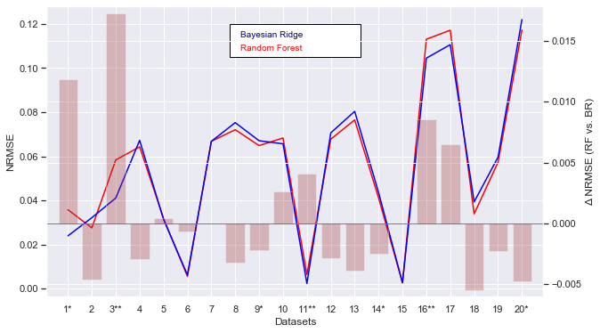
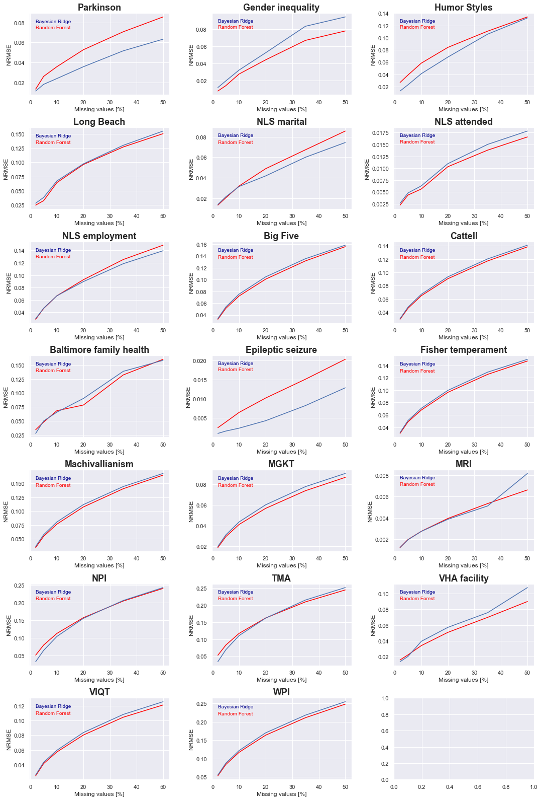
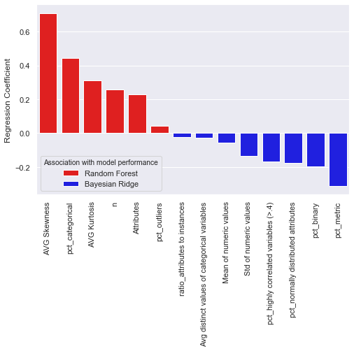
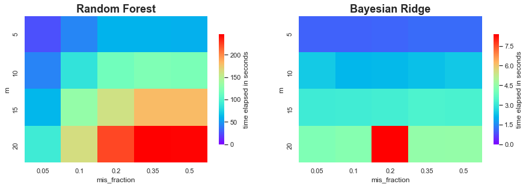

#Impact of dataset metafeature variation on the performance of Random Forest and Bayesian Ridge estimators in MICE

Missing value imputation is an important tool for every data analyst. For data with different data types and unusual patterns (e.g. no normal distribution) Multiple Imputation by chained-equations (MICE) is the first choice to estimate missing values. There are several estimators, that can be used to build the model for value estimation, the most powerful for MICE are Random Forest Regression and Bayesian Ridge Regression.
In this project, a comparison of both estimators was performed on 20 real word datasets, to see if one of them might be superior to the other.
As no algorithm can outperform every other algorithm under all circumstances ("No-Free-Lunch" Theorem), the comparison took place under the variation of dataset metafeatures, to aim for a set of features that indicate model selection.

The following approach was used:
* Extract dataset metafeatures from different open source real world datasets,
* Artificially create missing values in those datasets,
* Perform multiple imputations with MICE-Random Forest and MICE-Bayesian Ridge,
* Compare imputation performance for both estimators,
* Associate dataset metafeatures with model performance to get indicators of which model to choose for future imputation problems.
For all of the imputations, __Scikit-learn's IterativeImputer__ has been used.

#TLDR

##Conclusions
Random Forest and Bayesian Ridge as estimators for MICE differ significantly in relative imputation performance depending on dataset metafeatures.
It can be inferred from the analyses that RF performs better with high dimensionality and violation of normality assumptions whereas BR is indicated in the presence of multicollinearity and "easy" cases where variables are on metric scales.
Concerning computational performance, BR is about 50 times faster than RF.
Thus, it can be recommended to use Bayesian Ridge Regression as a default estimator and turn towards Random Forest in cases where the normality assumption is heavily violated.

##Results
The following results have been obtained:
* ###Overall relative imputation performance for RF and BR differs for variations of metafeatures:


For some datasets, differences in accuracy have been significant. Those are marked with __*__ for p $<$ 0.05 and with __**__ for p $<$ 0.01.
Other datasets (especially no. 6, 11, 15) seem to be somewhat 'easier' to impute having overall low NRMSEs and show no difference in imputation performance.
These datasets are characterized by high portions of 'metric variables'.


* ###Estimator selection importance increases with higher numbers of missing values


Three observations:
1. Imputation performance drops as missing values increase (which could be expected),
2. Where imputation performance is equal for few missing values, it stays that way for increasing fractions,
3. Where higher differences can be observed for few missing values, differences tend to be amplified with increasing missing values.

So we can say that the importance of estimator selection in MICE increases with increasing occurrences of missing values.


* ###Dimensionality, normality, variable type and multicollinearity have the most influence on model selection


Random Forests seem to perform better for large datasets, especially when normality cannot be assumed.
Bayesian Ridge Regression seems to work better on metric variables and in presence of multicollinearity (inter-correlated predictors).
It is important to point out that these results __seem__ to allow for these conclusions. Due to the low sample of datasets, the regression coefficients cannot be tested for significance and do not allow for robust inferences.


* ###Bayesian Ridge performs imputations about 50 times faster than Random Forest Regressor


We can clearly see, that BR performs its imputations about 50 times faster than RF. Furthermore, BR is not dependent on the fraction of missing values whereas RF imputation time increases with more missing values.


```python

```
